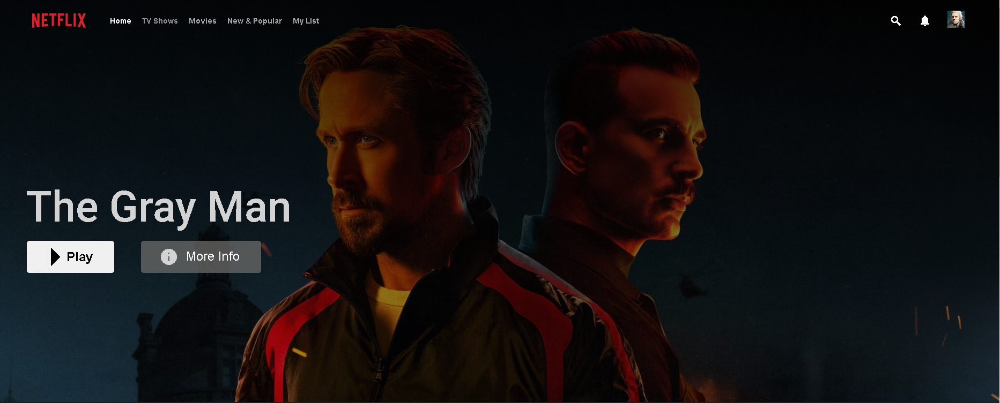
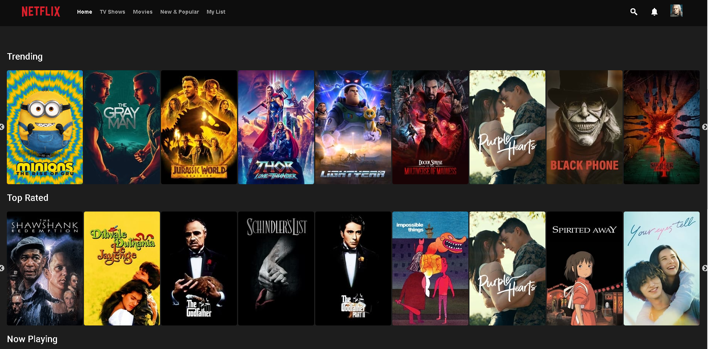
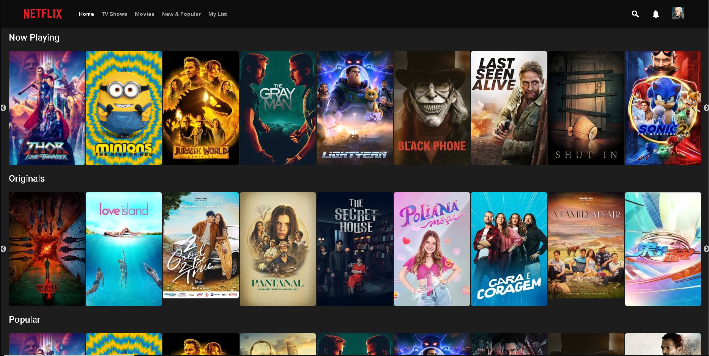

<div id="top"></div>


<h1 align="center">
    Netflix Clone
</h1>


## ABOUT THE PROJECT

<!-- ABOUT THE PROJECT -->
Welcome to the _GitHub repository_ of my **Netflix Clone** project! Here you can find information about the project's development, such as which technologies were used, how to install and run the project, usage and more.

<div align="center">

<p style="display: flex; align-items: flex-start; justify-content: center;">
   

  
  

</p>
</div>

This project is a clone of Netflix webpage to simulate the real site and was developed to showcase some of my skills and learn about Angular/CSS/REST API  and serve as an extension of my LinkedIn. 

<br />

---

### Built With

List of major frameworks/libraries used to bootstrap this project:

- [Angular][angular]
  - web client & client data management
- [Node.js](https://github.com/nodejs)
  - web server & services in service oriented architecure
- [TheMovieDB_API](https://api.themoviedb.org/)

<p align="right">(<a href="#top">back to top</a>)</p>


<!-- GETTING STARTED -->
## Getting Started

To get a local copy up and running follow these simple example steps.

### Prerequisites

* npm
  ```sh
  npm install npm@latest -g
  ```

### Installation

1. Clone the repo
   ```sh
   git clone https://github.com/paulofelipebrito/NetflixClone
   ```
2. Install NPM packages
   ```sh
   npm install
   ```
3. Start the app with ng
   ```sh
     ng s -o
   ```   
4. Visit `http://localhost:4200/` on your browser


<p align="right">(<a href="#top">back to top</a>)</p>


---

## Implementation Highlights

- application web client with Angular
- access to external data with movie service API (themoviedb)

### User Stories

- landing page has collections of movie for recommendations

### Current Plans for Expansion

- users could search for movies
- users could browse search result by pages
- users could select and view details of a movie
- users could see his/her history of browsed movie
- users could add or remove movie to his/her bookmark

### Future Plans for Expansion

- Machine Learning recommendation system?
- Machine Learning classification for recommended movie collections?
- scrape and stream videos for movies?

---

<p align="right">(<a href="#top">back to top</a>)</p>

## License

This project is licensed under the MIT License - see the LICENSE file for details

---

<!-- CONTACT -->
## Contact

Paulo Felipe Brito - [LinkedIn](https://www.linkedin.com/in/paulofelipebrito/) - paulofelipebrito@hotmail.com

<p align="right">(<a href="#top">back to top</a>)</p>

[nodejs]: https://nodejs.org/
[angular]: https://angular.io/
[vscode]: https://code.visualstudio.com/
[vceditconfig]: https://marketplace.visualstudio.com/items?itemName=EditorConfig.EditorConfig
[license]: https://opensource.org/licenses/MIT
[vceslint]: https://marketplace.visualstudio.com/items?itemName=dbaeumer.vscode-eslint
